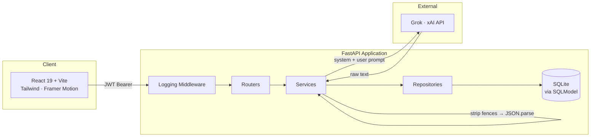
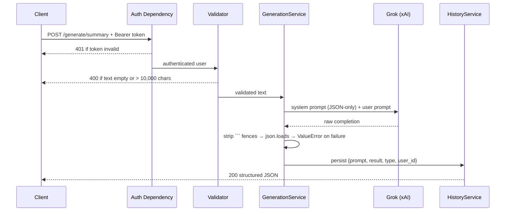

# AI Content Automation

Turn any document into publish-ready content. Upload a `.txt`, `.pdf`, or `.docx` file — or paste raw text — and get back structured summaries, titles, keywords, and social posts through a typed, authenticated REST API.


---

## Why this exists

LLM output is unreliable by default — it drifts, wraps JSON in markdown fences, and breaks downstream parsers. This project treats generation as **infrastructure, not a demo**: every model response is forced into a JSON contract, parsed defensively, validated, persisted, and scoped to the user who created it.

---

## Architecture



**Request lifecycle for a generation call**



---

## Features

| | Capability | Detail |
|---|---|---|
| 🔐 | **JWT authentication** | Registration, login, bcrypt-hashed passwords, `get_current_user` guard on every protected route |
| 📄 | **Multi-format ingestion** | `.txt`, `.pdf` (pypdf), `.docx` (python-docx) with extension allow-listing |
| 🧠 | **Four generation modes** | Summary, titles, keywords, social posts — each with its own JSON schema |
| 🛡️ | **Defensive JSON parsing** | Strips markdown code fences, raises a typed error instead of returning malformed data |
| 🗂️ | **Per-user history** | Every generation persisted and queryable; records are ownership-scoped |
| 🧾 | **Input validation** | Non-empty text, 10,000-character ceiling, password strength rules |
| 📊 | **Observability** | Loguru rotating file logs, HTTP logging middleware, centralized exception handlers |
| 🧪 | **Test suite** | pytest + httpx + pytest-asyncio with shared fixtures |

---

## API Reference

All routes except `/` and `/auth/*` require an `Authorization: Bearer <token>` header.

### Authentication
| Method | Endpoint | Description |
|---|---|---|
| `POST` | `/auth/register` | Create an account |
| `POST` | `/auth/login` | Exchange credentials for a JWT |

### Users
| Method | Endpoint | Description |
|---|---|---|
| `GET` | `/users/me` | Current user profile |
| `PUT` | `/users/me` | Partial profile update |

### Files
| Method | Endpoint | Description |
|---|---|---|
| `POST` | `/files/upload` | Upload a `.txt` / `.pdf` / `.docx` file |
| `GET` | `/files` | List your uploaded files |
| `GET` | `/files/{file_id}` | File metadata |
| `GET` | `/files/{file_id}/extract` | Extract plain text from a stored file |
| `DELETE` | `/files/{file_id}` | Delete a file |

### AI Generation
| Method | Endpoint | Returns |
|---|---|---|
| `POST` | `/generate/summary` | `{ "summary": "..." }` |
| `POST` | `/generate/title` | `{ "titles": [...] }` |
| `POST` | `/generate/keywords` | `{ "keywords": [...] }` |
| `POST` | `/generate/social` | `{ "posts": [...] }` |

### History
| Method | Endpoint | Description |
|---|---|---|
| `GET` | `/history` | All generations for the current user |
| `GET` | `/history/{generation_id}` | A single generation |
| `DELETE` | `/history/{generation_id}` | Delete a generation |

> Interactive OpenAPI docs are served at `/docs` once the server is running.

---

## Tech Stack

| Layer | Technologies |
|---|---|
| **API** | FastAPI · Uvicorn · Gunicorn |
| **Data** | SQLModel · SQLAlchemy · Alembic · SQLite |
| **Auth** | python-jose (JWT) · passlib · bcrypt |
| **AI** | Grok via the xAI API (OpenAI-compatible client) |
| **Parsing** | pypdf · python-docx |
| **Validation** | Pydantic · pydantic-settings · email-validator |
| **Observability** | Loguru · custom HTTP middleware |
| **Testing** | pytest · pytest-asyncio · httpx |
| **Frontend** | React 19 · TypeScript · Vite · Tailwind CSS 4 · Framer Motion · Three.js (`@react-three/fiber`, `drei`) · Axios |
| **Tooling** | Black · isort · flake8 · oxlint |

---

## Getting Started

### Backend

```bash
git clone https://github.com/rehaannazir/AI-Content-Automation.git
cd AI-Content-Automation

python -m venv venv
source venv/bin/activate      # Windows: venv\Scripts\activate

pip install -r requirements.txt
```

Create a `.env` file in the project root:

```env
BASE_URL=http://localhost:8000
SECRET_KEY=your-jwt-signing-secret
XAI_API_KEY=your-xai-api-key
GROK_MODEL=grok-beta
```

Run the API:

```bash
uvicorn app.main:app --reload
```

Tables are created automatically on startup via the FastAPI lifespan hook. Visit **http://localhost:8000/docs** for the interactive API explorer.

### Frontend

```bash
cd frontend
npm install
npm run dev
```

### Tests

```bash
pytest
```

---

## Project Structure

```
.
├── app/                  # Entrypoint, settings, database, logger
│   ├── main.py           # FastAPI app, middleware, router registration
│   ├── setting.py        # Env-backed Pydantic settings
│   └── database.py       # Engine + session dependency
├── auth/                 # JWT creation/verification, password hashing, guards
├── routers/              # HTTP layer — auth, user, file, generate, history
├── services/             # Business logic, including Grok calls + JSON parsing
├── repositories/         # Database access
├── models/               # SQLModel tables: User, File, Generation
├── schemas/              # Pydantic request/response contracts
├── middleware/           # Request logging
├── exceptions/           # Centralized error handlers
├── utils/                # File parsing, validators, response helpers
├── tests/                # pytest suite
└── frontend/             # React + TypeScript client
```

---

## Design Notes

**Layered by intent.** Routers stay thin — they validate, delegate, and return. Business rules live in `services/`, persistence in `repositories/`. Swapping the LLM provider means touching one service, not the HTTP layer.

**The model is not trusted.** `GenerationService.parseJSON` assumes the model will misbehave: it strips markdown fences, attempts a parse, logs the exception, and raises a typed `ValueError` rather than leaking malformed output downstream.

**Ownership is enforced at the query layer.** History and file lookups filter on `current_user.id`, so one user can never read or delete another's records by guessing an ID.

---

## License

Released under the MIT License.
